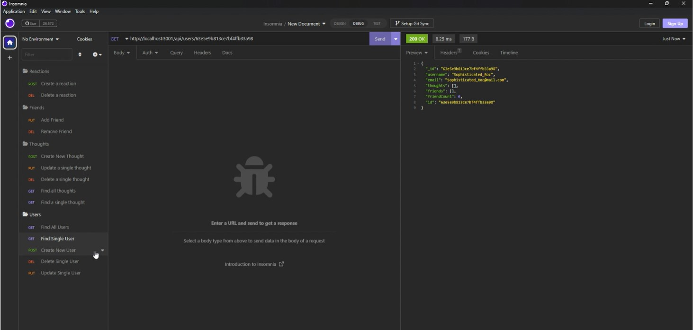

# NoSQL - Mongoose (MongoDB)

## Description
There are a multitude of social media sites on the web. This projects' purpose is to be able to create the back-end infrastructure of a new social media website where users can post thoughts, react to other users thoughts, and add friends to their friend lists.

I learned that NoSQL databases are much faster and more flexible than SQL databases. 

## Installation
1. Clone my [GitHub Repository](https://github.com/brigantinojoe/social_media)
2. Run `npm i` on you local terminal to download the npm packages.
3. Go to the config/connection.js file and adjust the `connectionString` variable to the connection string listed in your local MongoDB instance.
4. Run `node utils/seed.js` to create the seeds in your MongoDB database.
5. Open your [Insomnia app](https://insomnia.rest/), or something like it, to start testing the api routes.
6. Watch the short tutorial below if you're more of a visual person.
7. Enjoy!

